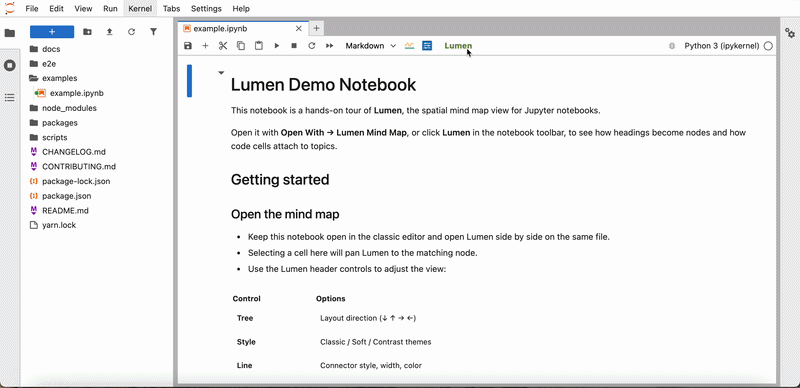

# Kuusi

*Kuusi* (Finnish for spruce) — Jupyter-native **notebook mind map**: rearrange `.ipynb` cells on a spatial canvas by markdown heading hierarchy, using **Jupyter's own cell renderers** (CodeCell / MarkdownCell — not a custom rich-text editor).

<p align="center">
  
</p>

> **Demo:** The GIF above was recorded with [`examples/example.ipynb`](examples/example.ipynb) open in **Kuusi Mind Map**.

## Version

| Component | Version |
|-----------|---------|
| **Kuusi** | `0.2.1` |
| `kuusi-kernel` | `0.2.1` |
| `jupyterlab-kuusi` | `0.2.1` |

See [CHANGELOG.md](./CHANGELOG.md) for release notes.

## Features

- **Native Jupyter cells** on a pannable, zoomable canvas with connector lines
- **Heading-driven tree**: `#` (H1) defines mind map roots; `##` / `###` / … nest underneath; other cells attach to the current heading
- **Empty node insertion**: Tab / Enter create blank markdown cells with correct outline placement (no `markdown cell N` placeholder)
- **Drag-and-drop** reordering with drop zones (before / inside / after)
- **Two-way notebook sync**: same `.ipynb` model; structural edits update the notebook
- **Notebook → Kuusi focus**: selecting a cell in the standard ipynb editor pans Kuusi to the matching node
- **Tree direction**: top-bottom, bottom-top, left-right, right-left
- **Style themes**: Classic, Soft, Contrast
- **Font**: notebook default plus sans-serif and serif families; adjustable size (Small → Extra Large)
- **Layout density**: Compact, Normal, Loose (XMind-style spacing)
- **Background**: Default, Plain (dark), Grid, Dots, Gradient, Business Blue, Eye Care, Newspaper
- **Appearance**: connector line and node border style, width, and color
- **Markdown format toolbar** (edit mode): Title (H1–H6), Aa (bold/italic/underline/strikethrough/code/highlight/block quote), list styles, table grid picker, image (Markdown/HTML), link (Markdown/HTML), font color
- **Persistent settings**: theme, font, layout, tree direction, background, and appearance survive refresh (JupyterLab settings)
- **Keyboard shortcuts** (XMind-style) — see **Guide** in the header
- **Zoom** presets from 10% to 200% (includes 100%) and fullscreen
- **Product menu**: current version, latest version check (with offline cache), GitHub link

## Installation

### Requirements

| Component | Minimum |
|-----------|---------|
| **JupyterLab** | 4.x |
| **Python** | 3.9+ |
| **Node.js + npm** | Required to build from source (see below) |
| **Git** | Required to clone the monorepo |

> **Note:** Kuusi is not published on PyPI yet. Install from this repository for now.

### Install from source (recommended)

Clone the repo, activate the Python environment where JupyterLab is installed, then run:

```bash
git clone https://github.com/xianghancao/lumen.git
cd kuusi
npm run jlab:install
jupyter lab
```

`npm run jlab:install` builds the extension, runs `pip install -e packages/jupyterlab-kuusi`, and rebuilds JupyterLab.

Use a specific Python/Jupyter if they are not first on your `PATH`:

```bash
KUUSI_PYTHON=/path/to/python KUUSI_JUPYTER=/path/to/jupyter npm run jlab:install
```

### Manual install

```bash
git clone https://github.com/xianghancao/lumen.git
cd kuusi

npm install
npm run build:extension

python -m pip install -e packages/jupyterlab-kuusi
jupyter lab build

jupyter lab
```

Run these commands from the **repository root** so the `kuusi-kernel` workspace package is available.

### Verify

```bash
npm run jlab:verify
# or
jupyter labextension list | grep -i kuusi
```

You should see `jupyterlab-kuusi` enabled.

### Uninstall

```bash
python -m pip uninstall jupyterlab-kuusi
jupyter lab build
```

### Open Kuusi

Open any `.ipynb` (try [`examples/example.ipynb`](examples/example.ipynb)), then either:

- Click **Kuusi** in the notebook toolbar, or
- **Right-click the file → Open With → Kuusi Mind Map**

You can keep the classic notebook view and Kuusi open on the same file side by side.

## Quick start

If you already installed Kuusi:

```bash
jupyter lab
```

Then open `examples/example.ipynb` with **Kuusi Mind Map** as described above.

## Using Kuusi

### Header (row 1)

Jupyter document toolbar: save, insert, cut/copy/paste, run, kernel, cell type, etc.

### Header (row 2)

| Area | Controls |
|------|----------|
| **Left** | **Add Mind Map** (+), **Kuusi** (version menu), **Tree**, **Style**, **Font**, **Line**, **Border**, **Layout**, **Background**, **Guide** |
| **Right** | Markdown **format** toolbar (visible in edit mode), see below |

#### Left toolbar

| Control | What it does |
|---------|----------------|
| **+** | Create a new notebook in the same folder and open it as a mind map |
| **Kuusi** | Current version, latest version (cached when offline), GitHub repository |
| **Tree** | Layout direction: ↓ ↑ → ← |
| **Style** | Mind map theme: Classic / Soft / Contrast |
| **Font** | Mind map typeface (notebook default, sans-serif, serif) and size (Small → Extra Large) |
| **Line** | Connector line style, width, color |
| **Border** | Node border style, width, color |
| **Layout** | Node spacing: Compact / Normal / Loose |
| **Background** | Canvas background: Default, Plain (dark), Grid, Dots, Gradient, Business Blue, Eye Care, Newspaper |
| **Guide** | Keyboard shortcuts for navigation and markdown formatting |

All of the above (except zoom and fullscreen) are **saved automatically** and restored on refresh.

#### Right format toolbar (edit mode, markdown cells)

| Control | What it does |
|---------|----------------|
| **Title** | Outline heading level H1–H6 (changes mind map structure) |
| **Aa** | Bold, italic, underline, strikethrough, inline code, highlight, block quote, code block, clear formatting |
| **List** | Bulleted, dashed, numbered, check list |
| **Table** | Grid picker to insert a Markdown table |
| **Image** | Insert image via Markdown or HTML syntax |
| **Link** | Insert link via Markdown or HTML syntax |
| **Font color** | Preset swatches, custom color, remove color |

> **Title** changes the outline tree. **Aa** and inline styles affect cell content only, not structure.

### Canvas

| Action | Behavior |
|--------|----------|
| **Single click** | Select node (persistent highlight) |
| **Double click** | Edit cell |
| **F2** | Enter edit mode |
| **Escape** | Exit edit mode |
| **Drag handle** (left edge) | Reorder in the outline tree |
| **Wheel** | Pan |
| **Ctrl/Cmd + wheel** | Zoom |
| **Bottom-right** | Node count, **Zoom** menu, **Fullscreen** |

### Outline rules

1. The first `#` heading in the notebook becomes a **root** node.
2. Deeper headings nest under the nearest higher-level heading.
3. Non-heading cells belong to the current heading context.
4. Content before the first `#` (or orphan `##+` without an H1 parent) is ignored in the map.
5. **Tab** inserts a child node; **Enter** inserts a sibling. New empty nodes keep the correct tree level even without a `#` heading in the source yet.

## Architecture

```
.ipynb (shared INotebookModel)
    → kuusi-kernel: heading outline tree + dagre layout
    → jupyterlab-kuusi: canvas with native Jupyter cell widgets
```

No Tiptap, React Flow, or separate `.lumen.json` sidecar in this line.

## Roadmap

Planned work after `0.2.0`. These items do not block the current release.

### `0.3.0`

#### Collapse branches

Core mind map capability. Much of the kernel and widget plumbing already exists (`collapsedIds` in layout, edges, and navigation); the remaining work is mostly UI and polish.

- Chevron on parent nodes to fold / unfold a branch
- Keyboard shortcut (e.g. Space on a selected topic)
- Badge showing hidden child count when collapsed
- Relayout after collapse so hidden subtrees free space
- Optional: collapse all / expand all / collapse to level N

#### Style themes (stronger visual presets)

Today Classic / Soft / Contrast differ only slightly (a few CSS variables). Make each preset visually distinct at a glance:

- **Classic** — keep the current Jupyter-neutral look (balanced borders, subtle shadow)
- **Soft** — larger corner radius (16px), lighter borders, pronounced card shadow, thinner and softer connector lines
- **Contrast** — bold H1 node border and background tint, thicker connectors, high-contrast palette (not only `brand-color1`)

Optional: small preview swatches in the Style menu (like Layout) so users can see the difference before switching.

### `0.3.x` / `0.4.0` — Export image & PDF

Presentation and sharing enhancements, not required for day-to-day editing.

- **PNG** — current viewport or entire map (DOM snapshot)
- **SVG** — structure-only export (titles + connectors from layout data)
- **PDF** — from PNG or print stylesheet

Likely order: viewport PNG first, then structure SVG, then PDF.

## Development

Requires the [installation requirements](#requirements) above. See [CONTRIBUTING.md](./CONTRIBUTING.md) for the full workflow.

```bash
# Kernel unit tests + extension TypeScript build check + version sync
npm run test

# Production labextension build (requires JupyterLab)
npm run test:release-build

# JupyterLab smoke E2E (requires: npm run jlab:install + Playwright Chromium)
npm run test:e2e
```

From the repository root:

```bash
# One-shot build + install into the active Python environment
npm run jlab:install

# Watch mode (separate terminal)
npm run jlab:dev
jupyter lab
```

Build individual packages:

```bash
npm run build:kernel
npm run build:extension:lib
npm run build:extension      # dev labextension (local install)
npm run build:release        # production labextension (PyPI / release)
```

Verify the extension:

```bash
npm run jlab:verify
```

## Repository layout

```
packages/
  kuusi-kernel/         # outline tree, layout, navigation
  jupyterlab-kuusi/     # JupyterLab extension + UI
docs/
  assets/               # UI overview SVG, demo GIF (optional)
examples/
  example.ipynb         # hands-on feature tour
scripts/
CHANGELOG.md
CONTRIBUTING.md
```

## Contributing

Bug reports, feature ideas, and pull requests are welcome. Read [CONTRIBUTING.md](./CONTRIBUTING.md) before opening a PR.

## License

BSD-3-Clause (extension)
